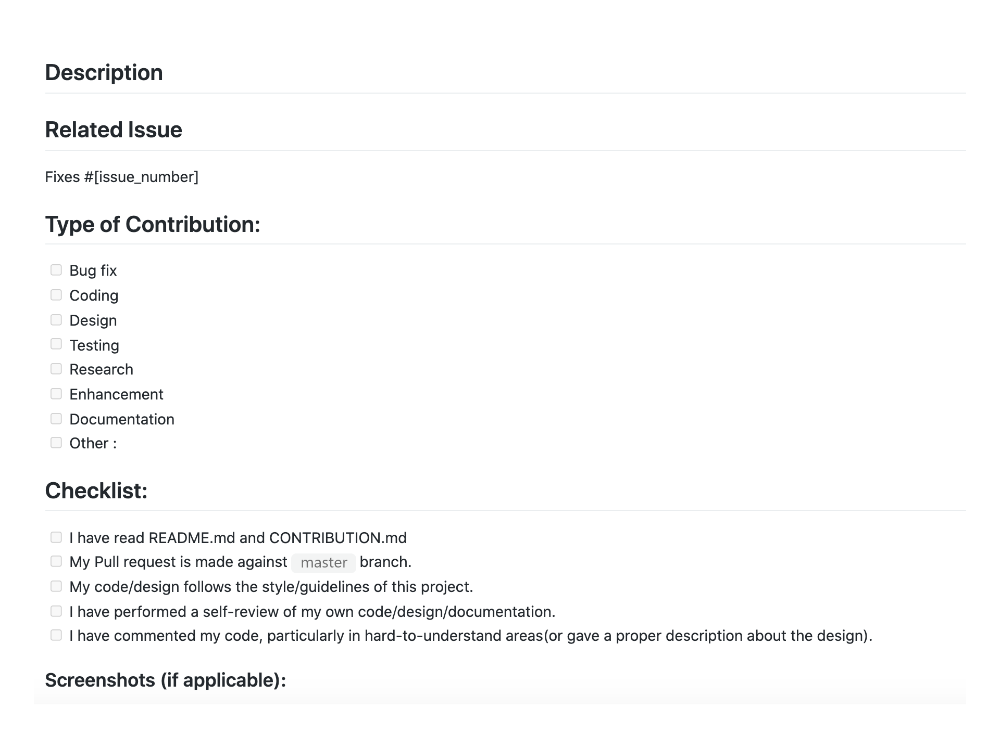

# Contribution is fun! :green_heart:

From opening a bug report to creating a pull request: every contribution is appreciated and welcome. If you're planning to implement a new feature or change the api please create an issue first. This way we can ensure that your precious work is not in vain.

Please take a moment to review this document in order to make the contribution process easy and effective for everyone involved.

Happy Contributing :slightly_smiling_face:

# Contributing Guidelines  
  
This documentation contains a set of guidelines to help you during the contribution process.
 
We are happy to welcome all the contributions from anyone willing to improve this project. Thank you for helping out and remember, **no contribution is small.** 
 
- Participants are expected to follow project guidelines and coding style.
- Participants/contributors have to give an update about their work in every **3 days** while completing issues. If not then the issue will be assigned to other.
- Participants/contributors have to **comment** on issues they would like to work on, and mentors will assign you. Direct PRs for Open to all issues .
- Issues will be assigned on a **first-come, first-serve basis**.
- Participants/contributors can also **open their issues**, but it needs to be verified and labelled by a mentor.
- Before opening a new issue, please **check** if it is already created or not.
- Pull requests will be merged after being **reviewed by a mentor**.
- Create a pull request from a **branch** other than `master` ,that means you have to create a new branch for every pull request.
- It might take a day to review your pull request. Please have patience and be nice.
- We all are here to learn. You are allowed to make mistakes. That's how you learn, right!
 
- **MAKE SURE TO OPEN A DRAFT PR AS SOON AS YOU START WORKING ON AN ISSUE AND KEEP COMMITING TO IT SO THAT WE CAN KNOW THAT YOU ARE WORKING ON THAT PARTICULAR ISSUE**
 
- Pull Requests review criteria:
  - Please fill the **PR template** properly while making a PR.
  - Example of the **PR template**
  
 
- **For any queries or discussions, please drop a message.**


## Creating Issues

### Bug Reports

A bug is a _demonstrable problem_ that is caused by the code in the repository.
Good bug reports are extremely helpful, so thanks!

### Feature requests

Feature requests are welcome. But take a moment to find out whether your idea
fits with the scope and aims of the project. It's up to _you_ to make a strong
case to convince the project's developers of the merits of this feature. Please
provide as much detail and context as possible.

In order to make the contribution
process easy and effective for everyone involved, Please follow the instructions mentioned below!

## Pull Requests

## :arrow_down: Installation

- First, fork this repository :fork_and_knife: and follow the given instructions:

```bash
# clone the repository to your local machine
$ git clone https://github.com/<YOUR-GITHUB-USERNAME>/CS-Hut.git

# navigate to the project's directory and install all the relevant dev-dependencies
$ cd CS-Hut

# add upstream
$ git remote add upstream https://github.com/shriya030/CS-Hut

# include all the latest changes from the remote repository
$ git fetch upstream
$ git merge upstream/master
```

Checkout to master branch
`$ git checkout master`

Next, create a new branch for the particular issue - `$ git checkout -b <NEW-BRANCH-NAME>` and make PR from that branch while leaving other branches unchanged :white_check_mark:

- Branch name should be FeatureName or FixName

- Once you have made your changes, run the following command:

```bash
# add your changes
$ git add .

# make your commit
$ git commit -m "<YOUR-COMMIT-MESSAGE>"
The commit message should be in the format - `(feature/try) - Added try component`

#push your changes
git push -u origin NEW-BRANCH-NAME
```

> Think you're ready :grey_question: Make the PR :tropical_drink:
> Always make PRs to master branch
